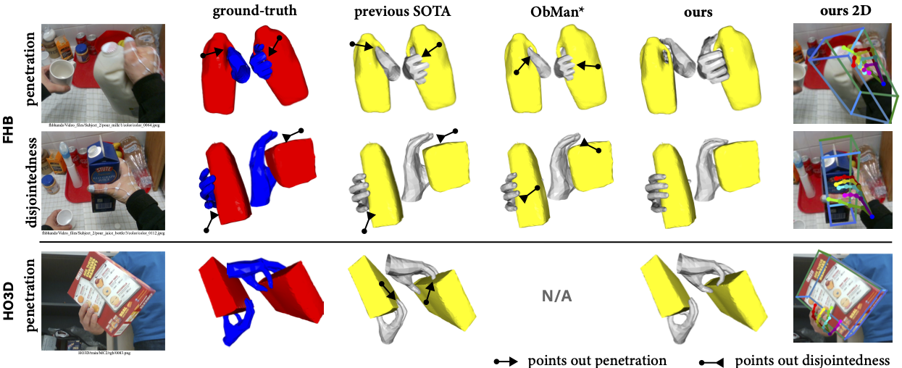
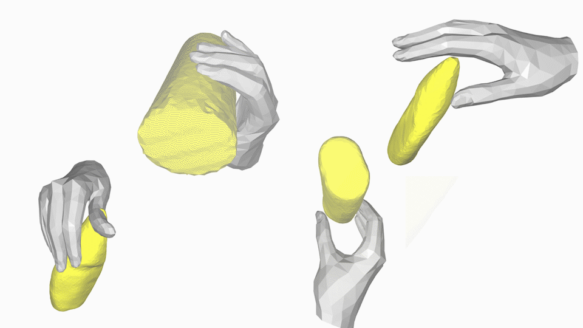

# Contact Potential Field

This repo contains model, demo, and test codes of our paper:
[CPF: Learning a **C**ontact **P**otential **F**ield to Model the Hand-object Interaction](https://arxiv.org/abs/2012.00924)

<p align="center">
    
</p>


# Guide to the Demo
## 1. Get our code:
```shell script
$ git clone --recursive https://github.com/lixiny/CPF.git
$ cd CPF
```
## 2. Set up your new environment:

```shell script
$ conda env create -f environment.yaml
$ conda activate cpf
```

## 3. Download [assets](https://drive.google.com/file/d/1IP7dJimk0G-rixfDprgYE0F8kquB6PWf/view?usp=sharing) files and put it in `assets` folder.

Download the MANO model files from [official MANO website](https://mano.is.tue.mpg.de/), and put it into `assets/mano`.
We currently only use the `MANO_RIGHT.pkl`

Now your `assets` folder should look like this:
```
.
├── anchor/
│   ├── anchor_mapping_path.pkl
│   ├── anchor_weight.txt
│   ├── face_vertex_idx.txt
│   └── merged_vertex_assignment.txt
├── closed_hand/
│   └── hand_mesh_close.obj
├── fhbhands_fits/
│   ├── Subject_1/
│   │   ├── ...
│   ├── Subject_2/
|   ├── ...
├── hand_palm_full.txt
└── mano/
    ├── fhb_skel_centeridx9.pkl
    ├── info.txt
    ├── LICENSE.txt
    └── MANO_RIGHT.pkl
```
## 4. Download Dataset
### First-Person Hand Action Benchmark (fhb)

Download and unzip the First-Person Hand Action Benchmark dataset following the [official instructions](https://github.com/guiggh/hand_pose_action) to the `data/fhbhands` folder
If everything is correct, your `data/fhbhands` should look like this:
```
.
├── action_object_info.txt
├── action_sequences_normalized/
├── change_log.txt
├── data_split_action_recognition.txt
├── file_system.jpg
├── Hand_pose_annotation_v1/
├── Object_6D_pose_annotation_v1_1/
├── Object_models/
├── Subjects_info/
├── Video_files/
├── Video_files_480/ # Optionally
```
Optionally, resize the images (speeds up training !) based on the [handobjectconsist/reduce_fphab.py](https://github.com/hassony2/handobjectconsist/blob/master/reduce_fphab.py).
```shell
$ python reduce_fphab.py
```
Download our [fhbhands_supp](https://drive.google.com/file/d/1hY_gyrZD_RU3nxI90oJZ6tNkwxKYhUGs/view?usp=sharing) and place it at `data/fhbhands_supp`:

Download our [fhbhands_example](https://drive.google.com/file/d/14wxN23RmVCSphHIV00qk-ht00yfdu_Hu/view?usp=sharing) and place it at `data/fhbhands_example`.
This `fhbhands_example` contains 10 samples that are designed to demonstrate our pipeline.

```
├── fhbhands/
├── fhbhands_supp/
│   ├── Object_models/
│   └── Object_models_binvox/
├── fhbhands_example/
│   ├── annotations/
│   ├── images/
│   ├── object_models/
│   └── sample_list.txt
```

### HO3D
Download and unzip the [HO3D](https://www.tugraz.at/index.php?id=40231) dataset following the [official instructions](https://github.com/shreyashampali/ho3d?) to the `data/HO3D` folder.
if everything is correct, the HO3D & YCB folder in your `data` should look like this:
```
data/
├── HO3D/
│   ├── evaluation/
│   ├── evaluation.txt
│   ├── train/
│   └── train.txt
├── YCB_models/
│   ├── 002_master_chef_can/
│   ├── ...
```

Download our [YCB_models_supp](https://drive.google.com/file/d/1daSKseF-PrVLwd4wIcF2PLtAjYBF2XH1/view?usp=sharing) and place it at `data/YCB_models_supp`

Now the `data` folder should have a root structure like:
```
data/
├── fhbhands/
├── fhbhands_supp/
├── fhbhands_example/
├── HO3D/
├── YCB_models/
├── YCB_models_supp/
```

## 5. Download pre-trained checkpoints
download our pre-trained [CPF_checkpoints](https://drive.google.com/file/d/1JWu5TSTTIWvNrTZmmjhTEm4xGqv_cMhd/view?usp=sharing), unzip it at the `CPF_checkpoints` folder:
```
CPF_checkpoints/
├── honet/
│   ├── fhb/
│   ├── ho3dofficial/
│   └── ho3dv1/
├── picr/
│   ├── fhb/
│   ├── ho3dofficial/
│   └── ho3dv1/
```

## 6. Launch visualization

We create a `FHBExample` dataset in `hocontact/hodatasets/fhb_example.py` that only contains 10 samples to demonstrate our pipeline.
Notice: this demo requires active screen for visualizing. Press `q` in the "runtime hand" window to start fitting.
```shell
$ python training/run_demo.py \
    --gpu 0 \
    --init_ckpt CPF_checkpoints/picr/fhb/checkpoint_200.pth.tar \
    --honet_mano_fhb_hand
```

<p align="center">
    
</p>

## 7. Test on full dataset

We provide python srcipts to test on the full dataset to approximately reproduce our results:

### FHB
dump:
```shell
$ python training/dumppicr_dist.py \
    --gpu 0,1 \
    --dist_master_addr localhost \
    --dist_master_port 12355 \
    --exp_keyword fhb \
    --train_datasets fhb \
    --train_splits train \
    --val_dataset fhb \
    --val_split test \
    --split_mode actions \
    --batch_size 8 \
    --dump_eval \
    --dump \
    --vertex_contact_thresh 0.8 \
    --filter_thresh 5.0 \
    --dump_prefix common/picr \
    --init_ckpt CPF_checkpoints/picr/fhb/checkpoint_200.pth.tar
```
and reload optimizer:
```shell
# hand only
$ CUDA_VISIBLE_DEVICES=0,1,2,3 python training/optimize.py \
    --n_workers 16 \
    --data_path common/picr/fhbhands/test_actions_mf1.0_rf0.25_fct5.0_ec \
    --mode hand

# hand obj
$ CUDA_VISIBLE_DEVICES=0,1,2,3 python training/optimize.py \
    --n_workers 16 \
    --data_path common/picr/fhbhands/test_actions_mf1.0_rf0.25_fct5.0_ec \
    --mode hand_obj \
    --compensate_tsl
```
### HO3Dv1
dump:
```shell
$ python training/dumppicr_dist.py  \
    --gpu 0,1 \
    --dist_master_addr localhost \
    --dist_master_port 12356 \
    --exp_keyword ho3dv1 \
    --train_datasets ho3d \
    --train_splits train \
    --val_dataset ho3d \
    --val_split test \
    --split_mode objects \
    --batch_size 4 \
    --dump_eval \
    --dump \
    --vertex_contact_thresh 0.8 \
    --filter_thresh 5.0 \
    --dump_prefix common/picr_ho3dv1 \
    --init_ckpt CPF_checkpoints/picr/ho3dv1/checkpoint_300.pth.tar
```
and reload optimizer:
```shell
# hand only
$ CUDA_VISIBLE_DEVICES=0,1,2,3,4,5,6,7 python training/optimize.py \
    --n_workers 24 \
    --data_path common/picr_ho3dv1/HO3D/test_objects_mf1_likev1_fct5.0_ec/ \
    --lr 1e-2 \
    --n_iter 500 \
    --hodata_no_use_cache \
    --lambda_contact_loss 10.0 \
    --lambda_repulsion_loss 4.0 \
    --repulsion_query 0.030 \
    --repulsion_threshold 0.080 \
    --mode hand

# hand obj
$ CUDA_VISIBLE_DEVICES=0,1,2,3,4,5,6,7 python training/optimize.py \
    --n_workers 24 \
    --data_path common/picr_ho3dv1/HO3D/test_objects_mf1_likev1_fct5.0_ec/ \
    --lr 1e-2 \
    --n_iter 500  \
    --hodata_no_use_cache \
    --lambda_contact_loss 10.0 \
    --lambda_repulsion_loss 6.0 \
    --repulsion_query 0.030 \
    --repulsion_threshold 0.080 \
    --mode hand_obj

```
### HO3Dofficial
dump:
```shell
$ python training/dumppicr_dist.py  \
    --gpu 0,1 \
    --dist_master_addr localhost \
    --dist_master_port 12356 \
    --exp_keyword ho3dofficial \
    --train_datasets ho3d \
    --train_splits val \
    --val_dataset ho3d \
    --val_split test \
    --split_mode official \
    --batch_size 4 \
    --dump_eval \
    --dump \
    --test_dump \
    --vertex_contact_thresh 0.8 \
    --filter_thresh 5.0 \
    --dump_prefix common/picr_ho3dofficial \
    --init_ckpt CPF_checkpoints/picr/ho3dofficial/checkpoint_300.pth.tar
```
and reload optimizer:
```shell
$ CUDA_VISIBLE_DEVICES=0,1,2,3,4,5,6,7 python training/optimize.py \
    --n_workers 24 \
    --data_path common/picr_ho3dofficial/HO3D/test_official_mf1_likev1_fct\(x\)_ec/  \
    --lr 1e-2 \
    --n_iter 500 \
    --hodata_no_use_cache \
    --lambda_contact_loss 10.0 \
    --lambda_repulsion_loss 2.0 \
    --repulsion_query 0.030 \
    --repulsion_threshold 0.080 \
    --mode hand_obj
```

## Results
We provide the test results at [here](https://github.com/lixiny/CPF/blob/main/fitting_res.txt).


## Citation
If you find this work helpful, please consider citing us:
```
@article{yang2020cpf,
  title={CPF: Learning a Contact Potential Field to Model the Hand-object Interaction},
  author={Yang, Lixin and Zhan, Xinyu and Li, Kailin and Xu, Wenqiang and Li, Jiefeng and Lu, Cewu},
  journal={arXiv preprint arXiv:2012.00924},
  year={2020}
}
```


