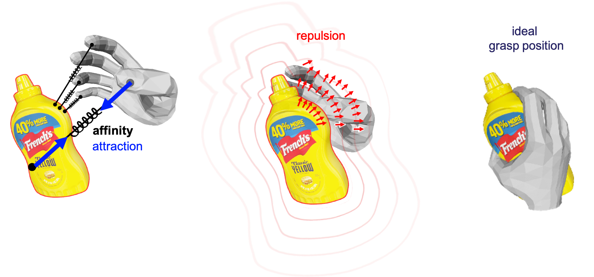

<!-- PROJECT LOGO -->
<br />
<p align="center">

  <h1 align="center">CPF: Learning a Contact Potential Field to Model the Hand-Object Interaction </h1>

  <p align="center">
    
  </p>
  <p align="center">
    ICCV, 2021
    <br />
    <a href="https://lixiny.github.io"><strong>Lixin Yang</strong></a>
    ·
    <a href=""><strong>Xinyu Zhan</strong></a>
    ·
    <a href=""><strong>Kailin Li</strong></a>
    ·
    <a href=""><strong>Wenqiang Xu</strong></a>
    ·
    <a href="https://jeffli.site"><strong>Jiefeng Li</strong></a>
    ·
    <a href="https://mvig.sjtu.edu.cn"><strong>Cewu Lu</strong></a>
  </p>

  <p align="center">
    <!-- <a href="https://pytorch.org/get-started/locally/"></a><br><br> -->
    <a href='https://arxiv.org/abs/2012.00924'>
      
    </a>
    <a href='https://lixiny.github.io/CPF' style='padding-left: 0.5rem;'>
      
    <a href='https://youtu.be/MLGpBFYiEQ0' style='padding-left: 0.5rem;'>
      
    </a>
  </p>
</p>

<br />

This repo contains model, demo, and test codes.
<!-- TABLE OF CONTENTS -->
<details open="open" style='padding: 10px; border-radius:5px 30px 30px 5px; border-style: solid; border-width: 1px;'>
  <summary>Table of Contents</summary>
  <ol>
    <li>
      <a href="#installation">Installation</a>
    </li>
    <li>
      <a href="#demo">Demo</a>
    </li>
    <li>
      <a href="#evaluation">Evaluation</a>
    </li>
    <li>
      <a href="#anatomical-constrained-a-mano">Anatomical Constrained A-MANO</a>
    </li>
    <li>
      <a href="#todo">TODO</a>
    </li>
    <li>
      <a href="#citation">Citation</a>
    </li>
  </ol>
</details>
<br />
<br />

## Installation
Following the [Installation Instruction](docs/Installation.md) to setup environment, assets, datasets and models.


## Demo
Notice: require active screen. 
### visualize GeO fitting pipeline

We create a `FHBExample` dataset in `hocontact/hodatasets/fhb_example.py` that only contains 10 samples to demonstrate our pipeline.

```shell
# Only support single GPU !
$ python scripts/run_demo.py \
    --gpu 0 \
    --init_ckpt CPF_checkpoints/picr/fhb/checkpoint_200.pth.tar \
    --honet_mano_fhb_hand
```
<p align="left">
  <br/>Press q in the "runtime hand" window to start fitting
</p>
<p align="center">
    
</p>

### visualize A-MANO'S anchor position
This demo shows the anochrs positions on MANO hand's surface
```shell
$ python scripts/recover_anchor.py --render
```
## Evaluation

We provide shell srcipts for evaluating on FHB, HO3Dv1 and v2.


### FHB dataset
dump the results of HoNet and PiCR:
```shell
# recommend 2 GPUs
$ export GPU_ID=0,1 && sh ./scripts/dump_HoNetPiCR_FHB.sh
```
and fit GeO optimizer:
```shell
# setting 1: hand-only 
# recommend 4 GPUs
$ export GPU_ID=0,1,2,3 && sh ./scripts/fit_GeO_handonly_FHB.sh

# setting 2: hand-obj
$ export GPU_ID=0,1,2,3 && sh ./scripts/fit_GeO_handobj_FHB.sh
```
### HO3Dv1
dump the results of HoNet and PiCR:
```shell
# recommend 2 GPUs
$ export GPU_ID=0,1 && sh ./scripts/dump_HoNetPiCR_HO3Dv1.sh
```
and fit GeO optimizer:
```shell
# hand-only
# recommend 8 GPUs
$ export GPU_ID=0,1,2,3,4,5,6,7 && sh ./scripts/fit_GeO_handonly_HO3Dv1.sh

# hand-obj
# recommend 8 GPUs
$ export GPU_ID=0,1,2,3,4,5,6,7 && sh ./scripts/fit_GeO_handobj_HO3Dv1.sh
```
### HO3Dv2 (version 2)
dump the results of HoNet and PiCR:
```shell
# recommend 2 GPUs
$ export GPU_ID=0,1 && sh ./scripts/dump_HoNetPiCR_HO3Dv2.sh
```
and fit GeO optimizer:
```shell
# recommend 8 GPUs
$ export GPU_ID=0,1,2,3,4,5,6,7 && sh ./scripts/fit_GeO_handobj_HO3Dv2.sh
```

### evaluation results
Above scripts may take a while ( ~ 1 day ). We also provide the results in [fitting_res](docs/fitting_res.txt).

## Anatomical Constrained A-MANO

We provide pytorch implementation of our Anatomical Constrained MANO in [lixiny/manopth](https://github.com/lixiny/manopth), which is modified from the original [hassony2/manopth](https://github.com/hassony2/manopth).


## TODO

- [x] testing code and pretrained models
  - [x] HoNet (FHB, HO3Dv1/v2)
  - [x] PiCR (FHB, HO3Dv1/v2)
- [x] fitting code of GeO, both *hand-only* and *hand-object* (FHB, HO3Dv1/v2)
- [ ] training code
- [ ] contact region visualization


# Citation
If you find this work helpful, please consider citing us:
```
@inproceedings{yang2021cpf,
    title={{CPF}: Learning a Contact Potential Field to Model the Hand-Object Interaction},
    author={Yang, Lixin and Zhan, Xinyu and Li, Kailin and Xu, Wenqiang and Li, Jiefeng and Lu, Cewu},
    booktitle={ICCV},
    year={2021}
}
```


